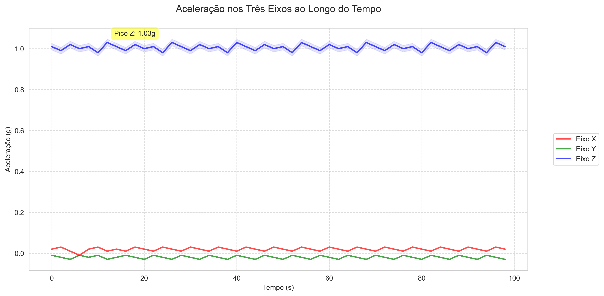
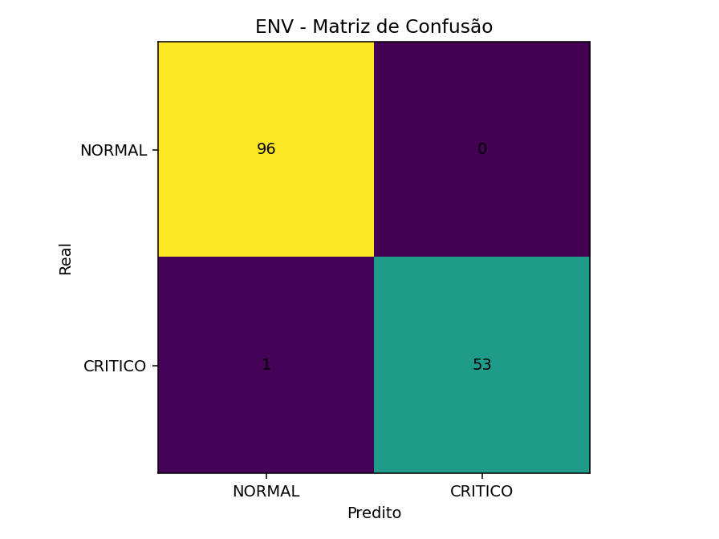
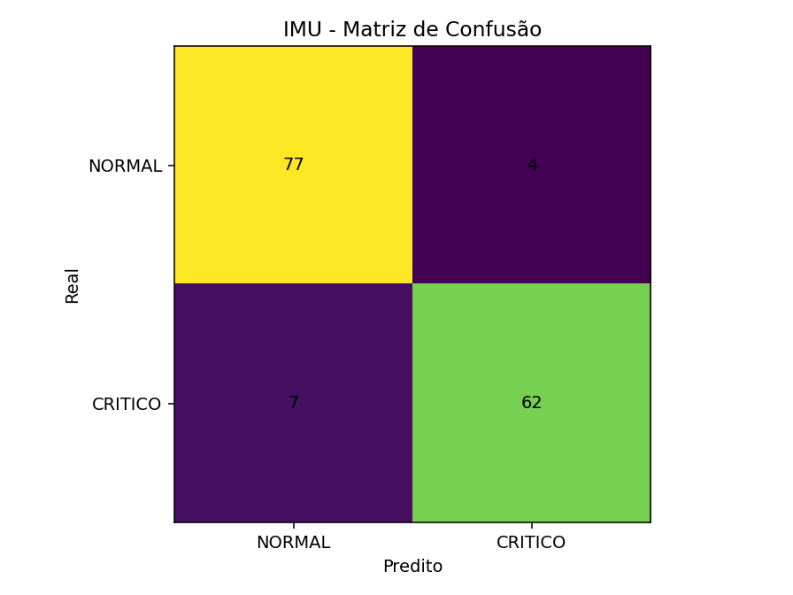
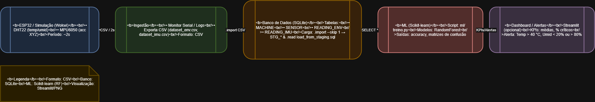

# FIAP - Faculdade de Informática e Administração Paulista

<p align="center">
<a href= "https://www.fiap.com.br/"></a>
</p>

<br>

# Nome do projeto
**Sistema simulado de monitoramento industrial e manutenção preditiva**
## Nome do grupo
Graduação - 1TIAOB - 2025/1 
## 👨‍🎓 Integrantes: 
- <a href="https://www.linkedin.com/in/danielcaffe">Daniel Caffé RM564440 </a>
- Ednilton RM566069 </a>
- Enrico RM561352 </a> 
- Davi RM566336 </a>

## 👩‍🏫 Professores:
### Tutor(a) 
- <a href="https://www.linkedin.com/company/inova-fusca">Lucas Gomes Moreira
### Coordenador(a)
- <a href="https://www.linkedin.com/company/inova-fusca">Nome do Coordenador</a>


## 📜 descrição

### proposta técnica enterprise challenge – sprint 1 - reply

Em pesquisa realizada em artigos científicos recentes que abordam os principais desafios da manutenção preditiva no setor automotivo, especialmente aqueles que ainda carecem de soluções definitivas, realizamos uma análise dos artigos abaixo com foco em identificar os principais desafios na análise preditiva de manutenção de equipamentos industriais, especialmente com aplicação no setor automotivo, mas também válidos para setores industriais em geral.

---

### Fontes

- **Artigo 1**: *Predictive maintenance enabled by machine learning: Use cases and challenges in the automotive industry* - ScienceDirect  
- **Artigo 2**: https://arxiv.org/abs/2401.07871  
- **Artigo 3**: https://arxiv.org/abs/2301.12467  
- **Artigo 4**: https://www.researchgate.net/publication/357557268_Predictive_Maintenance_in_the_Automotive_Sector_A_Literature_Review  
- **Artigo 5**: https://www.sciencedirect.com/science/article/pii/S1755581722001742  

---

## 🔍 Análise comparativa dos artigos científicos

### 1. Falta de dados de qualidade e em quantidade  
**Fontes**: artigos 1, 2, 4, 5

- dificuldade em coletar dados rotulados suficientes para treinar modelos eficazes (dados com falhas conhecidas);  
- dados de sensores frequentemente são ruidosos, incompletos ou não padronizados;  
- pouca disponibilidade de dados públicos devido à confidencialidade industrial;  
- a maioria dos modelos exige grandes volumes de dados históricos, que muitas empresas não têm.

> “A escassez de dados rotulados é uma barreira crítica para treinar modelos supervisionados eficazes em manutenção preditiva.” (art. 1)

#### Soluções inovadoras

- **aprendizado por transferência (transfer learning)**  
- **inteligência artificial generativa (GANs)**  
- **aprendizado federado**

---

### 2. Falta de interpretação e transparência (explainability)  
**Fonte**: artigo 2

- modelos complexos como redes neurais profundas (deep learning) são frequentemente caixas-pretas;  
- engenheiros e técnicos relutam em adotar soluções cujas decisões não são compreensíveis;  
- falta de ferramentas de explicação que traduzam previsões em ações claras.

> “A confiança dos operadores em modelos preditivos depende da capacidade de explicar as causas de possíveis falhas.” (art. 2)

#### Soluções inovadoras

- **inteligência artificial explicável (XAI)**  
- **visualizações interativas**

---

### 3. Generalização e adaptação a novas condições (aprendizado contínuo)  
**Fontes**: artigos 3 e 5

- modelos treinados com dados antigos perdem precisão quando aplicados a novas condições operacionais;  
- ambientes industriais são dinâmicos: peças trocam, sensores mudam, condições variam;  
- a maioria dos modelos não se adapta automaticamente.

> “Manter modelos atualizados sem treinamento constante manual é um desafio técnico e operacional significativo.” (art. 3)

#### Soluções inovadoras

- **aprendizado contínuo (continual learning)**  
- **gêmeos digitais (digital twins)**

---

### 4. Complexidade e multidimensionalidade dos dados industriais  
**Fonte**: artigo 4

- equipamentos industriais geram dados de múltiplos sensores em séries temporais complexas;  
- dificuldade em identificar relações entre variáveis e falhas sutis;  
- necessidade de ferramentas robustas de análise temporal.

> “A análise de sinais multivariados e o cruzamento de múltiplas fontes de dados são entraves ainda pouco resolvidos.” (art. 4)

#### Soluções inovadoras

- **modelos de autoencoders**  
- **análise de componentes principais (PCA) dinâmica**

---

### 5. Processamento em tempo real e custo computacional  
**Fonte**: artigo 5

- necessidade de respostas em tempo real com recursos limitados;  
- modelos com alto custo computacional dificultam implementação;  
- sensores IoT exigem algoritmos leves para análise local.

> “Existe um trade-off entre precisão e custo computacional que ainda não foi equilibrado em muitos sistemas industriais.” (art. 5)

#### Soluções inovadoras

- **computação de borda (edge computing)**  
- **modelos de machine learning otimizados**

---

## 🧩 Resumo dos principais desafios da manutenção preditiva industrial

| desafio                                       | descrição resumida                                                  |
|----------------------------------------------|----------------------------------------------------------------------|
| escassez de dados rotulados                  | falta de histórico confiável de falhas reais                         |
| modelos pouco interpretáveis                 | dificuldade de explicar decisões para técnicos                       |
| incapacidade de se adaptar a mudanças        | modelos fixos não funcionam bem com mudanças no ambiente             |
| complexidade dos dados multivariados         | difícil identificar padrões em sinais cruzados                       |
| limitações de processamento e custo          | difícil aplicar modelos pesados em dispositivos de campo             |

---

## 🎯 Foco do projeto

Desenvolveremos nosso projeto considerando o tópico **1. falta de dados de qualidade e em quantidade**.

**Fontes**: artigos 1, 2, 4, 5

- dificuldade em coletar dados rotulados suficientes para treinar modelos eficazes;  
- dados ruidosos, incompletos ou não padronizados;  
- baixa disponibilidade de dados públicos;  
- necessidade de grandes volumes históricos.

> “A escassez de dados rotulados é uma barreira crítica para treinar modelos supervisionados eficazes em manutenção preditiva.” (art. 1)

---

## 💡 Solução proposta

Elaborar um sistema onde as indústrias reportam dados de forma confidencial, aumentando o volume de dados rotulados. Em troca, recebem relatórios para análise preditiva.

> Inspirado em modelos como **Nielsen**, **IQVIA** e **Scanntech**.

---

## 🔧 Proposta técnica – etapa 1

**título do projeto**: plataforma SaaS de manutenção preditiva com cooperação industrial inteligente

---

## 🧩 Justificativa do problema

Indústrias enfrentam falhas inesperadas que causam prejuízos e altos custos. O maior obstáculo para adoção de IA é a escassez de dados rotulados de qualidade.

**destaques dos artigos**:

- dificuldade de coleta e padronização;  
- escassez de eventos de falha rotulados;  
- baixa disponibilidade de datasets abertos;  
- necessidade de grandes volumes históricos.

---

## 🛠️ Solução proposta

Desenvolver uma plataforma SaaS confidencial e colaborativa com:

- envio seguro e anônimo de dados;  
- relatórios com manutenção preditiva em troca;  
- maior poder preditivo dos modelos;  
- democratização da IA para pequenas e médias indústrias.

---

## 🧪 Tecnologias e ferramentas

| componente           | tecnologia sugerida                      |
|----------------------|-------------------------------------------|
| linguagem principal  | Python, R                                 |
| análise de dados     | Pandas, Scikit-learn, Keras, TensorFlow   |
| IoT e sensores       | ESP32 (Wi-Fi integrado)                   |
| banco de dados       | PostgreSQL (RDS AWS)                      |
| armazenamento nuvem  | AWS S3                                    |
| processamento        | AWS EC2 ou local                          |
| backend/API          | FastAPI (Python)                          |
| dashboard            | Streamlit, Dash ou Power BI               |
| alertas              | AWS SNS, email (SMTP), Firebase Push      |
| versionamento        | GitHub (privado)                          |

---

## 🔄 Pipeline de dados (esboço)

1. **coleta (simulada e/ou ESP32):**
   - dados em tempo real: temperatura, vibração, rotação;  
   - formato JSON via MQTT/HTTP para API.

2. **ingestão e armazenamento:**
   - FastAPI → PostgreSQL + S3.

3. **pré-processamento:**
   - remoção de ruídos e interpolação de dados ausentes.

4. **modelagem preditiva:**
   - modelos treinados com dados agregados e rotulados.

5. **dashboard e alertas:**
   - interface com status e previsões + alertas automáticos.

6. **relatórios automáticos:**
   - geração periódica de PDFs com recomendações.

---

## 🧭 Estratégia de coleta de dados

- **simulada (etapa atual)**: scripts Python com variabilidade controlada.  
- **planejada (futura)**: ESP32 com sensores reais (temperatura, vibração, ruído).

---

## 🧠 Integração com IA

- modelos treinados com:
  - dados sintéticos + reais anonimizados;
  - métodos supervisionados e semi-supervisionados.

- técnicas aplicadas:
  - Random Forest, LSTM (Keras), Isolation Forest (anomaly detection);
  - Data Augmentation para suprir escassez de rótulos;
  - Futuro uso de Aprendizado Federado para garantir privacidade.


ARQUITETURA DA SOLUÇÃO:

 

DIVISÃO DAS RESPONSABILIDADES:

| Fase                                  | Responsável Principal
|---------------------------------------|-----------------------
|1 Planejamento e Definição Técnica     | Ednilton
|2 Simulação e Coleta de Dados          | Daniel
|3 Armazenamento e Pipeline de Dados    | Larissa
|4 Modelagem e Predição de Falhas       | Enrico
|5 Dashboards, Alertas e Relatórios     | Davi


## 📁 Estrutura de pastas

Dentre os arquivos e pastas presentes na raiz do projeto, definem-se:

- <b>.github</b>: Nesta pasta ficarão os arquivos de configuração específicos do GitHub que ajudam a gerenciar e automatizar processos no repositório.

- <b>assets</b>: aqui estão os arquivos relacionados a elementos não-estruturados deste repositório, como imagens.

- <b>config</b>: Posicione aqui arquivos de configuração que são usados para definir parâmetros e ajustes do projeto.

- <b>document</b>: aqui estão todos os documentos do projeto que as atividades poderão pedir. Na subpasta "other", adicione documentos complementares e menos importantes.

- <b>scripts</b>: Posicione aqui scripts auxiliares para tarefas específicas do seu projeto. Exemplo: deploy, migrações de banco de dados, backups.

- <b>src</b>: Todo o código fonte criado para o desenvolvimento do projeto ao longo das 7 fases.

- <b>README.md</b>: arquivo que serve como guia e explicação geral sobre o projeto (o mesmo que você está lendo agora).

## 🔧 Como executar o código

*Acrescentar as informações necessárias sobre pré-requisitos (IDEs, serviços, bibliotecas etc.) e instalação básica do projeto, descrevendo eventuais versões utilizadas. Colocar um passo a passo de como o leitor pode baixar o seu código e executá-lo a partir de sua máquina ou seu repositório. Considere a explicação organizada em fase.*

## 🧪 Simulação da sprint 2 — coleta e análise de dados

## como executar o script de análise

Nesta etapa prática, foi implementado um circuito funcional com ESP32, integrando dois sensores virtuais no simulador Wokwi:

- **Sensor de temperatura e umidade DHT22**
- **Sensor de aceleração MPU6050**
- 
## Sensores utilizados e justificativa

- **DHT22 (temperatura e umidade):** amplamente utilizado em aplicações de ambiente industrial para monitoramento térmico.
- **MPU6050 (aceleração nos eixos X, Y e Z):** simula vibração e movimento, fundamental para prever desgaste mecânico em equipamentos.

Esses sensores foram conectados eletricamente no simulador e tiveram sua leitura programada em um código `.ino`. Os dados simulados foram coletados através do **Monitor Serial**, salvos em `.csv` e analisados usando um script em **Python** com bibliotecas como `pandas` e `matplotlib`.

### 📷 Imagens da simulação e do circuito

<p align="center">
  
  
</p>

### 📁 Arquivos da sprint 2

| tipo              | nome do arquivo                        | descrição                                       |
|------------------|----------------------------------------|------------------------------------------------  |
| código arduino   | `leitura_sensores.ino`                 | coleta dados de temperatura, umidade e aceleração|
| dados coletados  | `dados_coletados.csv`                  | dados simulados extraídos do monitor serial      |
| script python    | `analise_dados.py`                     | analisa dados e gera gráficos                    |
| estatísticas     | `estatisticas.txt`                     | min, máx e média dos sensores simulados          |
| link do projeto  | `wokwi_project_link.txt`               | link para simulação pública no Wokwi             |

### 📈 Gráficos gerados

- **temperatura e umidade ao longo do tempo**
- **aceleração nos eixos X, Y e Z (simulação de vibração)**

As leituras foram feitas com intervalo de 2 segundos, simulando variações suaves nos dados como ocorrem em equipamentos em operação estável.

### 🔍 Resumo dos dados analisados

| variável     | média     | mínima     | máxima     |
|--------------|-----------|------------|------------|
| temperatura  | ~26.4°C   | 24.0°C     | 29.4°C     |
| umidade      | ~62.0%    | 59.5%      | 65.0%      |
| acc_x        | ~0.00 g   | -0.02 g    | +0.03 g    |
| acc_y        | ~0.00 g   | -0.03 g    | +0.02 g    |
| acc_z        | ~1.00 g   | 0.98 g     | 1.03 g     |

Esses dados serão utilizados nas próximas etapas do projeto como base para **modelos preditivos de falhas** e **testes com redes neurais** em ambientes simulados de fábrica digital.

# Fase 5 — Hermes Reply (BD + ML)

## Banco de Dados
- Ferramenta do DER: **draw.io** (versátil e leve).
- Diagrama ER: `database/modelo_ER.png`  
- Script de criação: `database/script.sql`

### Como o banco de dados foi modelado
- Modelado a partir de um **DER** criado no draw.io.  
- Tabelas principais: `MACHINE`, `SENSOR`, `READING_ENV`, `READING_IMU`.  
- Relacionamentos 1:N entre máquina → sensor e sensor → leituras.  
- Criadas também tabelas de **staging (STG_ENV, STG_IMU)** para importar os CSVs simulados.  
- Dados transferidos para as tabelas finais usando o script `load_from_staging.sql`.

### Como foi feita a implementação do ML
- Implementado em **Python** com **Scikit-learn**.  
- Script principal: `ml/treino.py`.  
- Modelo utilizado: **Random Forest Classifier**.  
- Classificação binária:
  - **DHT22 (ENV):** NORMAL vs CRÍTICO (T > 40°C, H < 20% ou H > 80%).  
  - **MPU6050 (IMU):** NORMAL vs CRÍTICO (norma do vetor > 2.5 g).  

### Principais resultados obtidos
- **DHT22 (ENV):** Accuracy **0.9933**, apenas 1 erro em 150 leituras de teste.  
- **MPU6050 (IMU):** Accuracy **0.9267**, alguns erros de classificação mas desempenho satisfatório.  
- Matrizes de confusão geradas em:  
  - `ml/env_confusion.png`  
  - `ml/imu_confusion.png`  


**Tabelas:** MACHINE, SENSOR, READING_ENV, READING_IMU  
**Relacionamentos:** MACHINE 1:N SENSOR; SENSOR 1:N READING_ENV; SENSOR 1:N READING_IMU.

## Execução do banco (SQLite)
```bash
sqlite3 database/factory.db ".read database/script.sql"
sqlite3 database/factory.db ".mode csv" ".import --skip 1 document/dataset_env.csv STG_ENV" ".import --skip 1 document/dataset_imu.csv STG_IMU"
sqlite3 database/factory.db ".read database/load_from_staging.sql"
```
## Verificação esperada:

SENSORS|2
READING_ENV|500
READING_IMU|500

## Machine Learning (Scikit-learn)

- **Script:** `ml/treino.py`  
- **Métrica:** Accuracy  

### Tarefas
- ENV (DHT22): classificar **NORMAL** vs **CRITICO** (T > 40 °C, H < 20% ou H > 80%)  
- IMU (MPU6050): classificar **NORMAL** vs **CRITICO** (norma do vetor > 2.5 g)  

### Resultados obtidos
- ENV → Accuracy **0.9933**  
- IMU → Accuracy **0.9267**  

### Matrizes de confusão
 

### Dados utilizados
- `document/dataset_env.csv` (≥500 leituras do DHT22)  
- `document/dataset_imu.csv` (≥500 leituras do MPU6050)  

### Vídeo (≤ 5 min)
- URL:"https://youtu.be/IBZ7BStmcsk"

## Arquitetura Final


### Fluxo do MVP

1. **Coleta (ESP32 / Simulação - Wokwi)**  
   - Sensores utilizados:  
     - **DHT22** → temperatura e umidade  
     - **MPU6050** → aceleração (eixos X, Y, Z)  
   - Leituras periódicas (~2s) exportadas em CSV.  

2. **Ingestão**  
   - Leituras capturadas pelo **Monitor Serial** e exportadas para os arquivos:  
     - `document/dataset_env.csv`  
     - `document/dataset_imu.csv`  
   - Formato utilizado: **CSV**.  

3. **Banco de Dados (SQLite)**  
   - Tabelas principais: `MACHINE`, `SENSOR`, `READING_ENV`, `READING_IMU`.  
   - Scripts:  
     - `database/script.sql` (criação das tabelas)  
     - `database/load_from_staging.sql` (carga a partir dos CSVs).  
   - Garantia de integridade com **chaves primárias e estrangeiras**.  

## 🚀 Como executar

1. Criar e popular o banco de dados:

> Pré-requisitos: Python 3.10+, `pip install -r requirements.txt` (pandas, numpy, scikit-learn, matplotlib).  
> No Windows, se o comando `sqlite3` não estiver no PATH, use o caminho completo do executável como no exemplo abaixo.

```powershell
# Windows PowerShell (ajuste o caminho do sqlite3.exe se necessário)

> Obs.: Os comandos abaixo usam o caminho absoluto do meu PC (Windows).  
> Caso `sqlite3` esteja configurado no PATH, basta rodar sem o caminho completo, por exemplo:
> ```bash
> sqlite3 database/factory.db ".read database/script.sql"
> ```
& "B:\ENRICO\sql\sqlite-tools-win-x64-3500400\sqlite3.exe" database/factory.db ".read database/script.sql"
& "B:\ENRICO\sql\sqlite-tools-win-x64-3500400\sqlite3.exe" database/factory.db ".mode csv" ".import --skip 1 document/dataset_env.csv STG_ENV" "import--skip1 document/dataset_imu.csv STG_IMU"
& "B:\ENRICO\sql\sqlite-tools-win-x64-3500400\sqlite3.exe" database/factory.db ".read database/load_from_staging.sql"
```
2. Conferir se o banco foi populado corretamente:

SELECT COUNT(*) AS SENSOR FROM SENSOR;
SELECT COUNT(*) AS READING_ENV FROM READING_ENV;
SELECT COUNT(*) AS READING_IMU FROM READING_IMU;

 - Saída esperada:
   SENSORS|2
   READING_ENV|500
   READING_IMU|500


3. Rodar o treino de Machine Learning:

- Acurácia exibida no console
- Matrizes de confusão geradas em: 
   - ml/env_confusion.png
   - ml/imu_confusion.png  

4. **Machine Learning (Scikit-learn)**  
   - Script: `ml/treino.py`  
   - Modelo: **RandomForestClassifier**  
   - Objetivo: classificar estados **NORMAL** vs **CRÍTICO**.  
   - Saídas:  
     - Acurácia obtida:  
       - **ENV** → 0.9933  
       - **IMU** → 0.9267  
     - Matrizes de confusão salvas em:  
       - `ml/env_confusion.png`  
       - `ml/imu_confusion.png`.  

5. **Dashboard / Alertas**  
   - Possível implementação em **Streamlit** ou notebook.  
   - Métricas monitoradas (KPIs):  
     - Temperatura > 40 °C → **CRÍTICO**  
     - Umidade < 20% ou > 80% → **CRÍTICO**  
     - Aceleração > 2.5 g → **CRÍTICO**  
   - Geração de alertas simulados em tempo real.  

## 🗃 Histórico de lançamentos

* 0.1.0 - 09/05/2025
* 0.2.0 - 11/06/2025
* 0.3.0 - 07/09/2025

## 📋 Licença

<p xmlns:cc="http://creativecommons.org/ns#" xmlns:dct="http://purl.org/dc/terms/"><a property="dct:title" rel="cc:attributionURL" href="https://github.com/agodoi/template">MODELO GIT FIAP</a> por <a rel="cc:attributionURL dct:creator" property="cc:attributionName" href="https://fiap.com.br">Fiap</a> está licenciado sobre <a href="http://creativecommons.org/licenses/by/4.0/?ref=chooser-v1" target="_blank" rel="license noopener noreferrer" style="display:inline-block;">Attribution 4.0 International</a>.</p>


